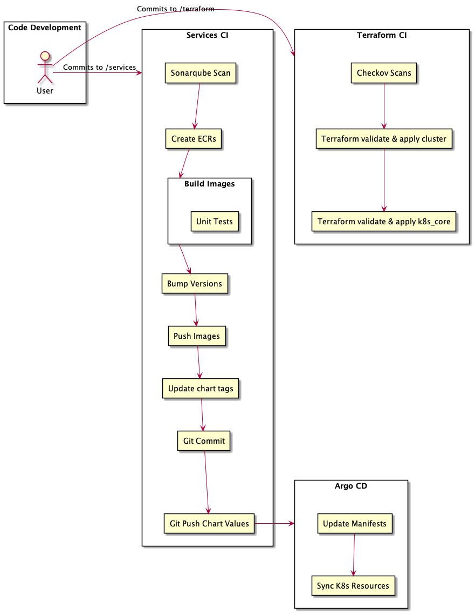
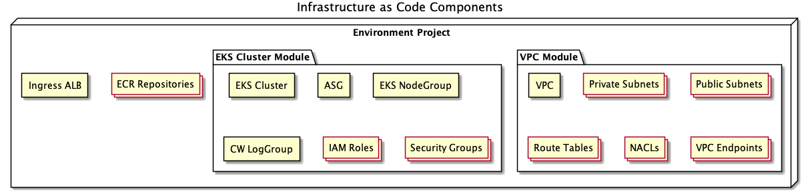
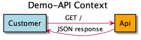
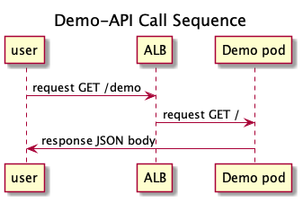

# k8s-demo

This repository is a demonstration of a simple Kubernetes cluster used to serve a basic REST microservice endpoint, hosted AWS. It deploys the core AWS infrastructure along with the Kubernetes resources required to host the service. 

AWS infrastructure along with a few core Kubernetes resources are deployed using Terraform, while Kuberenetes applications are deployed with Argo CD. 

# Local Deployment
To build, provision, and deploy the service from your local machine, you can run the create script from the repository root, `scripts/create.sh`.

To cleanup the cloud resources created with the script above, simply run the destroy script, `scripts/destroy.sh`. 

Note that some dependencies are required in the AWS account prior to deployment of these resources. Primarily, Systems Manager parameters are required for the Argo-CD and Grafana admin passwords. Additionally, ECR repositories are intended to be created from the CI process described below, so they may need to be created manually.

# CI / CD Workflow
The preferred approach to deploy this repository's services is through the Github workflows defined in .github.  Described below, these two workflows and the Argo CD application continuosuly integrate and deploy services to the Kubernetes cluster.

### Services CI
Scans, tests, builds, and pushes docker images for each service described in the docker-compose.yml file. Semantic version patch numbers are bumped, and references are updated in the docker-compose and application chart values file. This change is committed and pushed, which triggers the Argo-CD Sync to deploy the new version. Triggers on any change to /services.

### Terraform CD
Scans, tests, and applies terraform configurations. Triggers on any change to /terraform.

### CI / CD Workflow Diagram

## Cloud Resources
* Shared Resources
  * VPC
  * Subnets 
  * Availability Zones
  * Security groups
* EKS Cluster

## Kubernetes Resources
* ArgoCD
* Prometheus
* Grafana
* Demo Microservice

## Resource Configuration
All AWS resources defined above are configured and deployed from terraform project, as shown below.

## API Design

